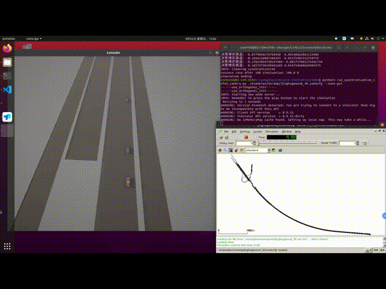
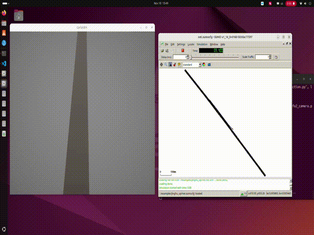

# CARLA-SUMO Co-Simulation with Interactive Decision Planning

This project implements a co-simulation framework integrating CARLA (an open-source autonomous driving simulator) and SUMO (Simulation of Urban MObility) with advanced interactive decision planning and interactive background traffic simulation capabilities.

## 📋 Table of Contents

- [Features](#features)
- [System Architecture](#system-architecture)
- [Prerequisites](#prerequisites)
- [Installation](#installation)
- [Project Structure](#project-structure)
- [Usage](#usage)
- [Configuration](#configuration)
- [Reinforcement Learning Module](#reinforcement-learning-module)
- [Interactive Planning Module](#interactive-planning-module)
- [Examples](#examples)
- [Demo Videos](#demo-videos)

## ✨ Features

- **CARLA-SUMO Co-Simulation**: Seamless integration between CARLA and SUMO for realistic traffic simulation
- **Interactive Decision Planning**: Advanced planning algorithms for autonomous vehicle behavior in interactive scenarios
- **Anti-Bully Model**: Intelligent decision-making system to handle aggressive driving behaviors
- **Reinforcement Learning**: PPO (Proximal Policy Optimization) implementation for training background traffic
- **OpenDRIVE Support**: Load custom road networks using OpenDRIVE format
- **Multiple Scenarios**: Pre-configured highway scenarios including on-ramp and off-ramp merging
- **Real-time Visualization**: Camera-based visualization support for monitoring simulation

## 🏗️ System Architecture

The system consists of three main components:

1. **CARLA Simulation**: Provides high-fidelity 3D simulation environment
2. **SUMO Integration**: Manages traffic flow and vehicle spawning
3. **Interactive Planning**: Decision-making and control for ego vehicle

```
┌─────────────────┐      ┌──────────────────┐      ┌─────────────────┐
│  CARLA Server   │◄────►│  Bridge Module   │◄────►│  SUMO TraCI     │
└─────────────────┘      └──────────────────┘      └─────────────────┘
                                   │
                         ┌─────────▼──────────┐
                         │  Planning Module   │
                         │  - Decision Making │
                         │  - Control         │
                         │  - RL Agent        │
                         └────────────────────┘
```

## 📦 Prerequisites

- **CARLA Simulator** (0.9.x recommended)
- **SUMO** (1.8.0 or higher)
- **Python** 3.7 or higher
- **Operating System**: Linux (Ubuntu 20.04)

### Required Python Packages

```
lxml==4.6.2
numpy
pandas
torch
traci
```

## 🚀 Installation

### 1. Install CARLA

Download and install CARLA from the [official website](https://carla.org/):

```bash
# Linux
cd /path/to/carla
./CarlaUE4.sh
```

### 2. Install SUMO

```bash
# Linux (Ubuntu)
sudo add-apt-repository ppa:sumo/stable
sudo apt-get update
sudo apt-get install sumo sumo-tools sumo-doc

# Set SUMO_HOME environment variable
export SUMO_HOME="/usr/share/sumo"
```

### 3. Clone the Repository

```bash
git clone https://github.com/FrankRun/Interactive-Planning-and-Simulation.git
cd Interactive-Planning-and-Simulation
```

### 4. Install Python Dependencies

```bash
pip install -r requirements.txt
```

### 5. Configure CARLA Python API

Add CARLA Python API to your Python path:

```bash
export PYTHONPATH=$PYTHONPATH:/path/to/carla/PythonAPI/carla/dist/carla-*.egg
```

## 📁 Project Structure

```
Sumo-github/
├── data/                           # Data files
│   └── vtypes.json                 # Vehicle type definitions
├── examples/                       # Example configurations
│   ├── onramp/                     # On-ramp scenarios
│   ├── offramp/                    # Off-ramp scenarios
│   └── viewsettings.xml            # SUMO view settings
├── image/                          # Demo videos and images
├── RL/                             # Reinforcement Learning module
│   ├── ppo.py                      # PPO algorithm implementation
│   ├── ppo_main.py                 # Training script
│   ├── cheryenvironment.py         # Custom RL environment
│   ├── replaybuffer.py             # Experience replay buffer
│   └── PPO_preTrained/             # Pre-trained models
├── sumo_integration/               # SUMO integration modules
│   ├── carla_simulation.py         # CARLA simulation wrapper
│   ├── sumo_simulation.py          # SUMO simulation wrapper
│   ├── bridge_helper.py            # Bridge utilities
│   └── interaction_planning/       # Interactive planning module
│       ├── interaction_planning.py # Main planning logic
│       ├── antibully_model.py      # Anti-bully decision model
│       ├── antibully_model_v2.py   # Enhanced anti-bully model
│       ├── PID.py                  # PID controller
│       └── model.py                # Neural network models
├── util/                           # Utility scripts
│   ├── netconvert_carla.py         # Network conversion tools
│   └── create_sumo_vtypes.py       # Vehicle type generator
├── load_xodr.py                    # OpenDRIVE map loader
├── spawn_npc_sumo.py               # NPC spawning script
├── run_synchronization.py          # Basic co-simulation
├── run_synchronization_info2_bev.py  # Co-simulation with ego-vehicle bev monitor 
└── run_simulation.sh               # Bash launcher script
```

## 💻 Usage

### Basic Co-Simulation

1. **Start CARLA Server**:

```bash
cd /path/to/carla
./CarlaUE4.sh
```

2. **Load OpenDRIVE Map** (if using custom map):

```bash
python load_xodr.py
```

3. **Run Co-Simulation**:

```bash

# With bev visualization
python run_synchronization_info2_camera.py --sumo-cfg-file examples/jinghugaosu.sumocfg
```

### Using the Launch Script

For Linux users, a convenient bash script is provided:

```bash
# Edit run_simulation.sh to set your paths
chmod +x run_simulation.sh
./run_simulation.sh
```

### Command Line Arguments

```bash
python run_synchronization_info2_camera.py \
    --sumo-cfg-file examples/jinghugaosu.sumocfg \
    --carla-host localhost \
    --carla-port 2000 \
    --sumo-gui \
    --sync-vehicle-all \
    --tls-manager carla
```

**Available Options:**
- `--sumo-cfg-file`: Path to SUMO configuration file
- `--carla-host`: IP of the CARLA server (default: localhost)
- `--carla-port`: TCP port to connect to CARLA (default: 2000)
- `--sumo-gui`: Enable SUMO GUI
- `--sync-vehicle-all`: Synchronize all vehicles
- `--tls-manager`: Traffic light manager (carla/sumo)

## ⚙️ Configuration

### SUMO Configuration

SUMO scenarios are defined using `.sumocfg` files located in the `examples/` directory:

- **On-ramp scenarios**: `examples/onramp/jinghugaosu{0_30,30_60,60_90}.sumocfg`
- **Off-ramp scenarios**: `examples/offramp/jinghugaosu{0_30,30_60,60_90}.sumocfg`

Each scenario includes:
- Network file (`.net.xml`)
- Route file (`.rou.xml`)
- Vehicle type definitions

## 🤖 Reinforcement Learning Module

The RL module implements PPO (Proximal Policy Optimization) for training interactivate background traffic agents.

### Training

```bash
cd RL
python ppo_main.py --env_name highway --train
```

## 🧠 Interactive Planning Module

The interactive planning module handles decision-making in complex traffic scenarios.

### Key Components

1. **Decision Module**: Analyzes traffic situation and makes interactivate decisions
2. **Control Module**: Executes decisions through acceleration/deceleration commands
3. **Data Recording**: Logs trajectory and decision data for analysis

## 📚 Examples

### Scenario 1: Highway On-Ramp Merging

```bash
python run_synchronization_info2_camera.py \
    --sumo-cfg-file examples/onramp/jinghugaosu30_60.sumocfg \
    --sumo-gui
```

### Scenario 2: Highway Off-Ramp Exit

```bash
python run_synchronization_info2_camera.py \
    --sumo-cfg-file examples/offramp/jinghugaosu60_90.sumocfg \
    --sumo-gui
```

## 🎥 Demo Videos

Demo videos are available in the `image/` directory:








## 📧 Contact

For questions, issues, or suggestions:
- Open an issue on GitHub
- Email: [frankyan@tongji.edu.cn]


